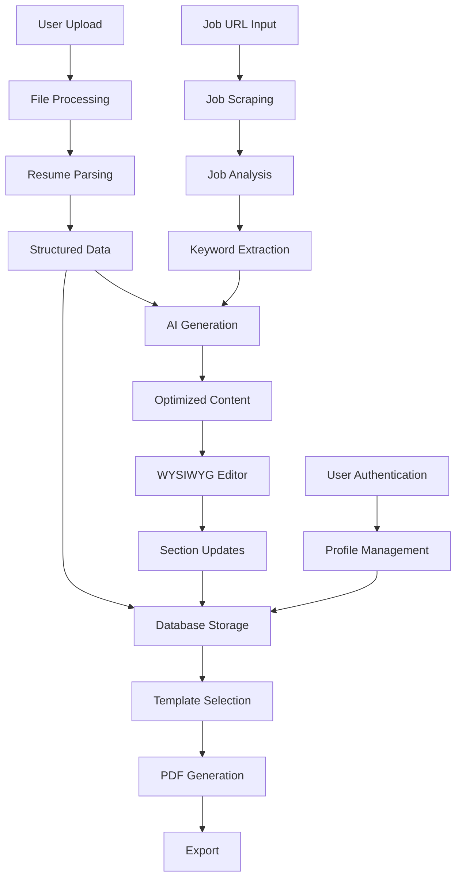

# Data Structures Documentation - Resume Builder AI

## Overview

This document describes all the data structures used in the Resume Builder AI application, including database schemas, TypeScript interfaces, API request/response formats, and internal data models.

## Table of Contents

1. [Database Schema](#database-schema)
2. [Core TypeScript Interfaces](#core-typescript-interfaces)
3. [API Data Structures](#api-data-structures)
4. [Resume Content Models](#resume-content-models)
5. [Template System](#template-system)
6. [Parsing & Analysis Models](#parsing--analysis-models)
7. [Authentication & User Data](#authentication--user-data)
8. [Data Flow Diagram](#data-flow-diagram)

---

## Database Schema

### Supabase Database Structure

The application uses PostgreSQL via Supabase with the following tables:

#### `profiles` Table
```sql
CREATE TABLE profiles (
  id UUID REFERENCES auth.users ON DELETE CASCADE PRIMARY KEY,
  created_at TIMESTAMP WITH TIME ZONE DEFAULT TIMEZONE('utc'::text, NOW()) NOT NULL,
  email TEXT NOT NULL,
  full_name TEXT,
  avatar_url TEXT
);
```

**TypeScript Interface:**
```typescript
interface Profile {
  Row: {
    id: string
    created_at: string
    email: string
    full_name: string | null
    avatar_url: string | null
  }
  Insert: {
    id: string
    created_at?: string
    email: string
    full_name?: string | null
    avatar_url?: string | null
  }
  Update: {
    id?: string
    created_at?: string
    email?: string
    full_name?: string | null
    avatar_url?: string | null
  }
}
```

#### `resumes` Table
```sql
CREATE TABLE resumes (
  id UUID DEFAULT uuid_generate_v4() PRIMARY KEY,
  created_at TIMESTAMP WITH TIME ZONE DEFAULT TIMEZONE('utc'::text, NOW()) NOT NULL,
  user_id UUID REFERENCES profiles(id) ON DELETE CASCADE NOT NULL,
  title TEXT NOT NULL,
  content JSONB NOT NULL,
  is_public BOOLEAN DEFAULT false NOT NULL
);
```

**TypeScript Interface:**
```typescript
interface Resume {
  Row: {
    id: string
    created_at: string
    user_id: string
    title: string
    content: Json  // Complex nested structure (see Resume Content Models)
    is_public: boolean
  }
  Insert: {
    id?: string
    created_at?: string
    user_id: string
    title: string
    content: Json
    is_public?: boolean
  }
  Update: {
    id?: string
    created_at?: string
    user_id?: string
    title?: string
    content?: Json
    is_public?: boolean
  }
}
```

---

## Core TypeScript Interfaces

### Base Types
```typescript
// Flexible JSON type for dynamic content
export type Json =
  | string
  | number
  | boolean
  | null
  | { [key: string]: Json | undefined }
  | Json[]

// Complete database structure
export interface Database {
  public: {
    Tables: {
      profiles: Profile
      resumes: Resume
    }
    Views: {
      [_ in never]: never
    }
    Functions: {
      [_ in never]: never
    }
    Enums: {
      [_ in never]: never
    }
  }
}
```

---

## API Data Structures

### Resume Generation API (`/api/generate`)

**Request:**
```typescript
interface GenerateRequest {
  resume: string        // Original resume text (max 10,000 chars)
  jobDescription: string // Job description (max 5,000 chars)
}
```

**Response:**
```typescript
interface GenerateResponse {
  optimizedContent: string
  analysis: {
    keywords: string[]
    relevantSections: string[]
    relevanceScore: number  // 0-100
    skillRequirements: {
      required: string[]
      preferred: string[]
      experience: string[]
    }
    suggestions: string[]
  }
}
```

**Error Response:**
```typescript
interface ErrorResponse {
  error: string
}
```

### Resume Upload API (`/api/upload`)

**Request:**
- FormData with file upload (PDF/DOCX)

**Response:**
```typescript
interface UploadResponse {
  success: boolean
  data: {
    personalInfo: {
      name?: string
      email?: string
      phone?: string
      address?: string
    }
    experience: Array<{
      company: string
      position: string
      startDate: string | undefined
      endDate: string | undefined
      description: string
    }>
    education: Array<{
      institution: string
      degree: string
      graduationDate?: string
    }>
    skills: CategorizedSkill[]
    summary?: string
    rawText: string
    confidence: {
      score: number
      issues: string[]
    }
    id: string  // Resume ID in database
  }
}

interface CategorizedSkill {
  name: string
  category?: string
  confidence: number
}
```

### Section Regeneration API (`/api/regenerate-section`)

**Request:**
```typescript
interface RegenerateRequest {
  sectionId: string
  sectionType: 'experience' | 'education' | 'skills' | 'summary' | 'other'
  currentContent: string
  jobDescription: string
  resumeId: string
}
```

**Response:**
```typescript
interface RegenerateResponse {
  content: string  // New regenerated content
}
```

---

## Resume Content Models

### Resume Section Data
```typescript
interface ResumeSectionData {
  id: string
  title: string
  type: 'experience' | 'education' | 'skills' | 'summary' | 'other'
  content: string  // HTML content for WYSIWYG editor
  isCollapsed?: boolean
}
```

### Personal Information
```typescript
interface PersonalInfo {
  fullName: string
  email: string
  phone: string
  location: string
  summary: string
}
```

### Work Experience
```typescript
interface Experience {
  title: string
  company: string
  duration: string
  description: string
}
```

### Education
```typescript
interface Education {
  degree: string
  school: string
  year: string
  details: string
}
```

### Complete Resume Data Structure
```typescript
interface ResumeContent {
  personal: PersonalInfo
  experience: Experience[]
  education: Education[]
  skills: string[]
  sections?: ResumeSectionData[]  // For editor-based content
}
```

---

## Template System

### Resume Template
```typescript
interface ResumeTemplate {
  id: string
  name: string
  description: string
  thumbnail: string
  isAtsOptimized: boolean
  styles: TemplateStyles
  layout: TemplateLayout
  customizationOptions: CustomizationOptions
}
```

### Template Styles
```typescript
interface TemplateStyles {
  fontFamily: string
  fontSize: {
    base: string
    heading1: string
    heading2: string
    heading3: string
  }
  colors: {
    primary: string
    secondary: string
    text: string
    background: string
    accent: string
  }
  spacing: {
    section: string
    paragraph: string
    line: string
  }
  borders?: {
    style: string
    width: string
    color: string
  }
}
```

### Template Layout
```typescript
interface TemplateLayout {
  columns: 1 | 2
  sectionOrder: string[]
  headerPosition: 'top' | 'left' | 'right'
  margins: {
    top: string
    right: string
    bottom: string
    left: string
  }
}
```

### Customization Options
```typescript
interface CustomizationOptions {
  allowColorChange: boolean
  allowFontChange: boolean
  allowLayoutChange: boolean
  colorPresets?: string[]
  fontPresets?: string[]
}
```

### Template Preview Props
```typescript
interface TemplatePreviewProps {
  template: ResumeTemplate
  resumeData: any
  customizations?: Partial<TemplateStyles>
}
```

---

## Parsing & Analysis Models

### Parsed Resume Data
```typescript
interface ParsedResumeData {
  personalInfo: {
    name?: string
    email?: string
    phone?: string
    address?: string
  }
  experience: Array<{
    company: string
    position: string
    startDate: string | undefined
    endDate: string | undefined
    description: string
  }>
  education: Array<{
    institution: string
    degree: string
    graduationDate?: string
  }>
  skills: CategorizedSkill[]
  summary?: string
  rawText: string
}
```

### Validation Results
```typescript
interface ValidationResult {
  isValid: boolean
  confidence: number
  issues?: string[]
}

interface ValidationResults {
  personalInfo: ValidationResult
  experience: ValidationResult[]
  education?: ValidationResult[]
  skills?: ValidationResult
}
```

### Parsed Field with Confidence
```typescript
interface ParsedField<T> {
  value: T
  confidence: number
}
```

### Job Analysis Results
```typescript
interface JobAnalysis {
  keywords: string[]
  skillRequirements: {
    required: string[]
    preferred: string[]
    experience: string[]
  }
}
```

### Resume Analysis Results
```typescript
interface ResumeAnalysis {
  relevantSections: string[]
  relevanceScore: number
  suggestions: string[]
}
```

---

## Authentication & User Data

### User (from Supabase Auth)
```typescript
interface User {
  id: string
  email: string
  created_at: string
  // Additional Supabase auth fields...
}
```

### Session Data
```typescript
interface Session {
  user: User
  access_token: string
  refresh_token: string
  expires_at: number
  // Additional session fields...
}
```

---

## Data Flow Diagram



## Data Relationships

### Primary Relationships
1. **User → Profiles**: One-to-one relationship via Supabase Auth
2. **Profile → Resumes**: One-to-many relationship
3. **Resume → Sections**: One-to-many embedded relationship (JSONB)
4. **Template → Resume**: Many-to-many relationship (template applied to resume)

### Key Constraints
- All resume data is tied to authenticated users via RLS policies
- Resume content is stored as JSONB for flexibility
- File uploads are processed and converted to structured data
- Templates are predefined and applied at render/export time

## Performance Considerations

### Database Indexing
```sql
-- Existing indexes
CREATE INDEX idx_resumes_user_id ON resumes(user_id);
CREATE INDEX idx_resumes_is_public ON resumes(is_public);

-- Recommended additional indexes
CREATE INDEX idx_resumes_created_at ON resumes(created_at);
CREATE INDEX idx_profiles_email ON profiles(email);
```

### Data Size Limits
- Resume text: 10,000 characters max
- Job description: 5,000 characters max
- File upload: 10MB max
- JSONB content: Practically unlimited but monitored

### Caching Strategy
- Template data: Cached in memory (rarely changes)
- User sessions: Cached via Supabase
- AI responses: Not cached (unique per request)
- Parsed resume data: Persisted in database

---

*Last updated: December 2024*
*Version: 1.0* 